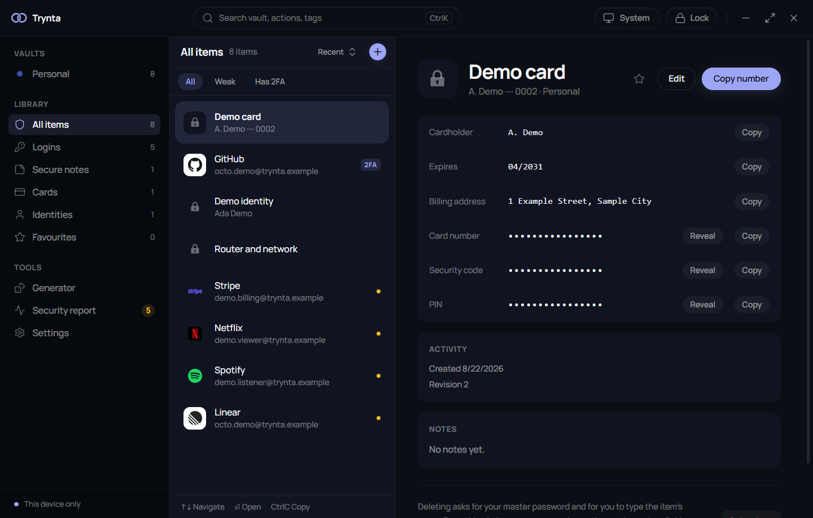
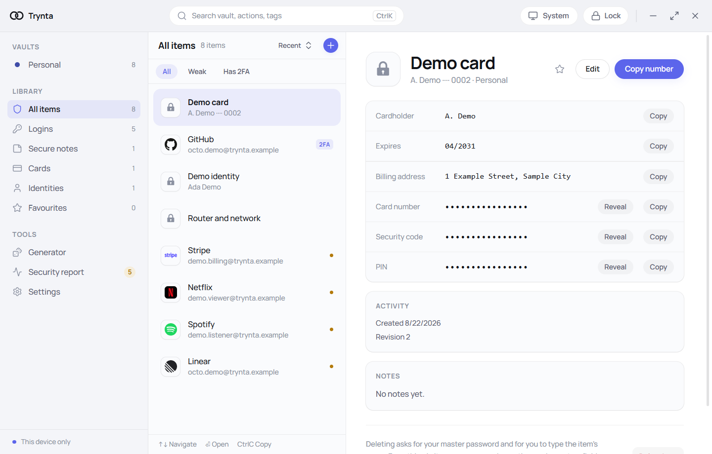
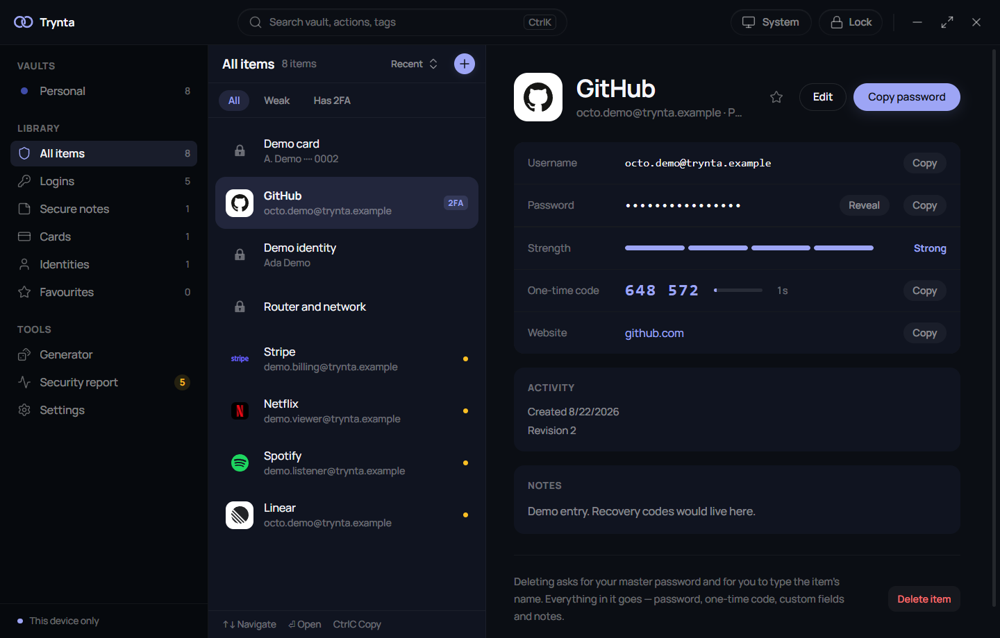
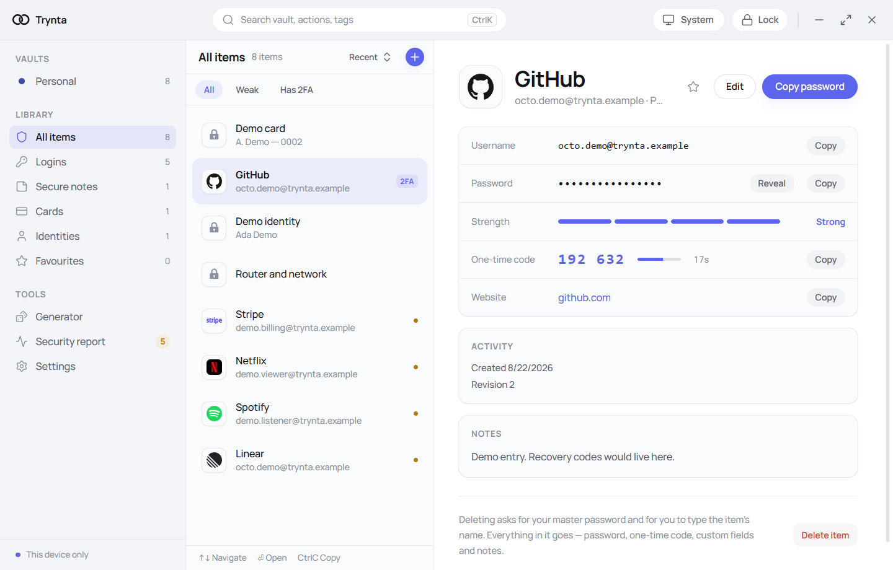
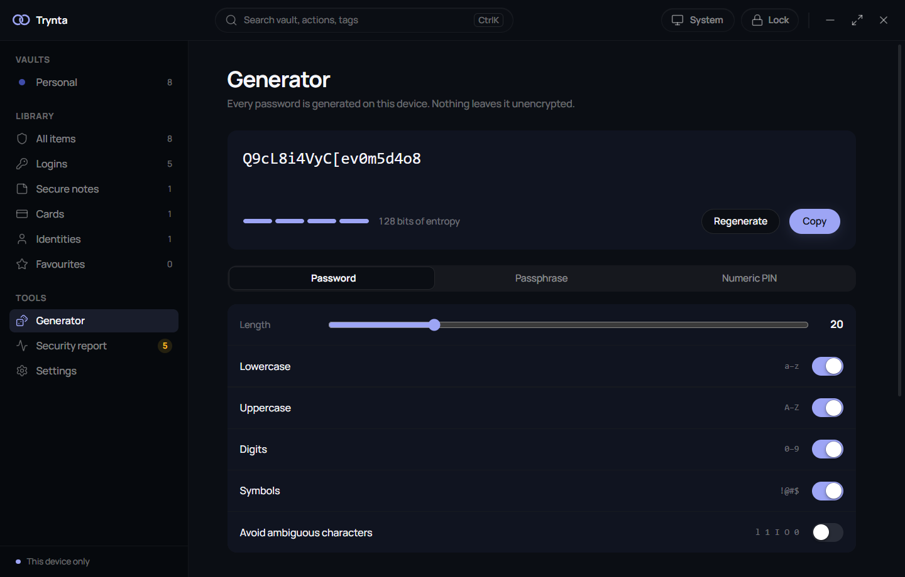
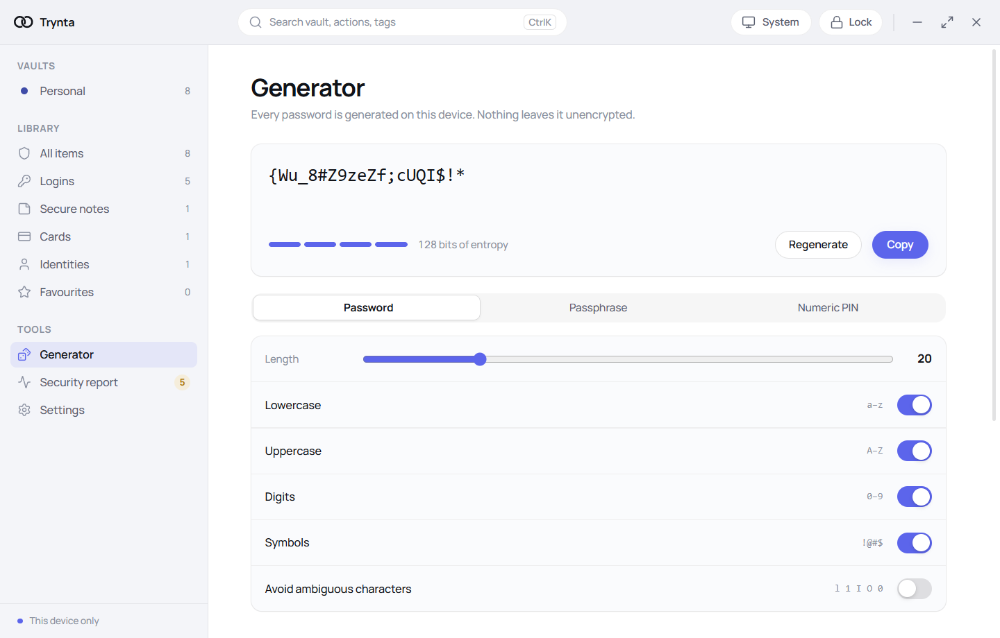
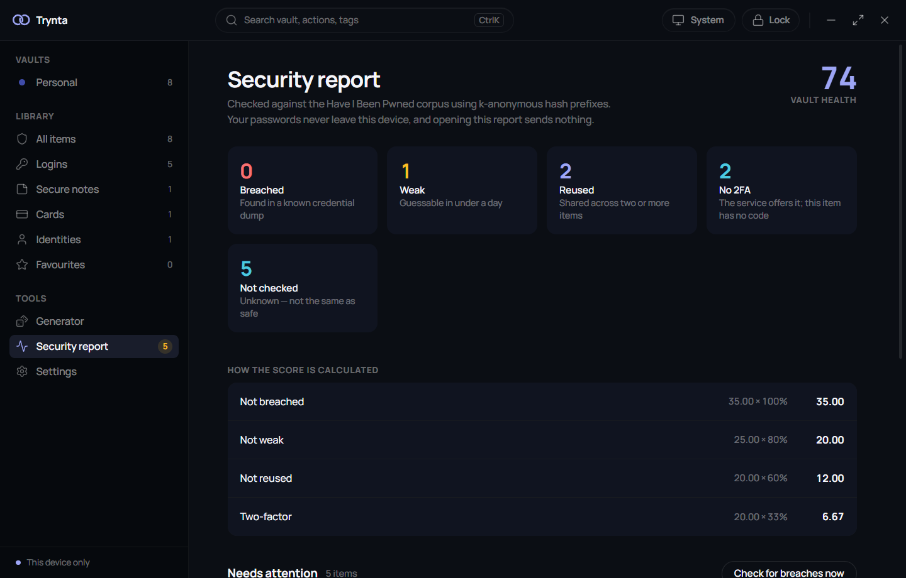
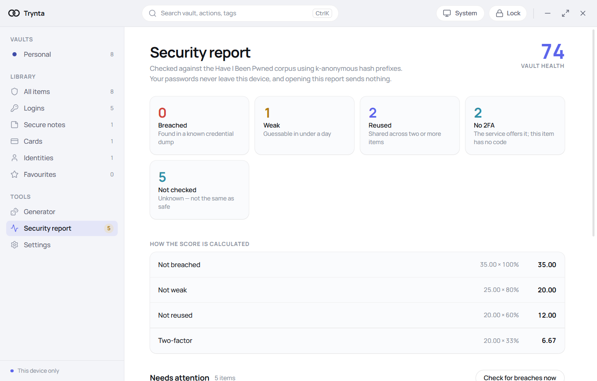
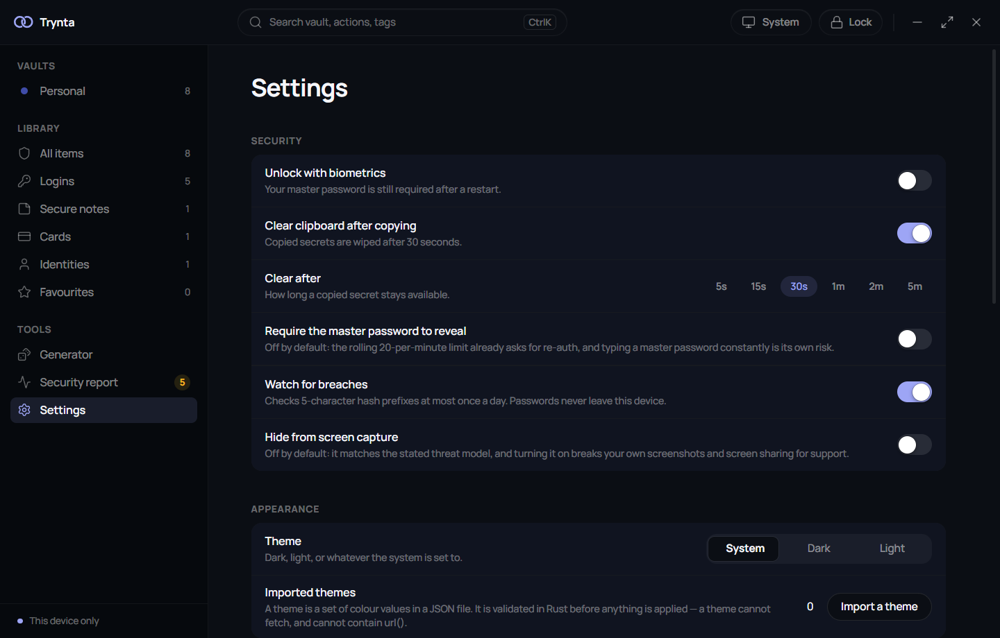
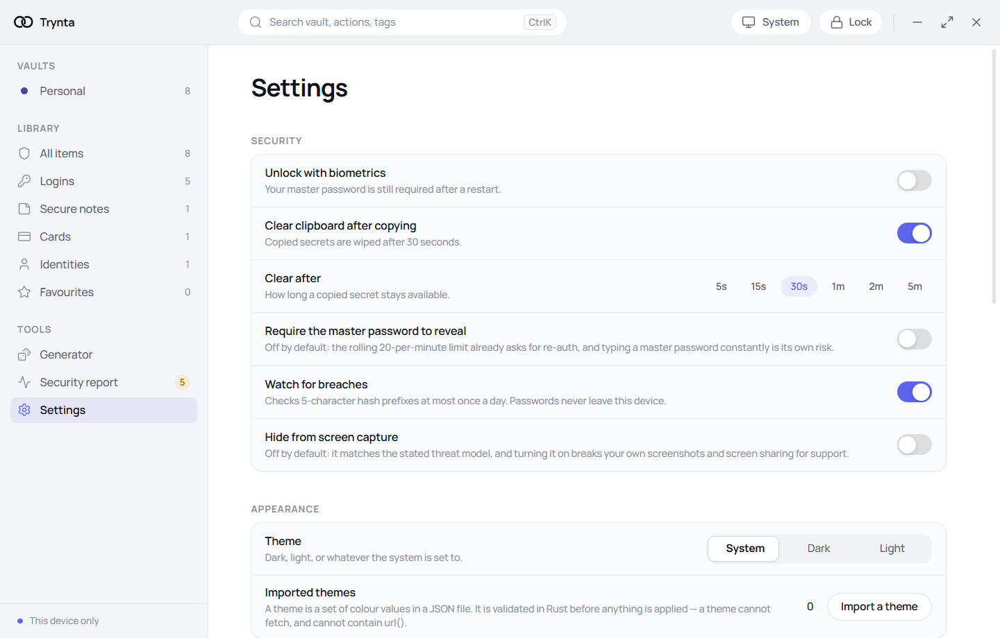

<div align="center">


# Trynta

**A local-first, end-to-end encrypted password manager for the desktop.**

Tauri&nbsp;v2 · Rust · React · SQLite &nbsp;·&nbsp; AGPL-3.0-or-later

</div>

---

> ### Read this before you try it
>
> Trynta is **pre-1.0 and has never been security-audited.** No third party has reviewed
> the cryptography, the storage format or the platform code. **Do not put real credentials
> in it.**
>
> - **Windows is the only verified platform.** Every push runs the full acceptance gate on
>   `windows-latest`.
> - **The macOS build compiled and passed the gate once, on 2026-08-17 — and nothing macOS has
>   been compiled since.** ADD-005 moved it to tags-only that afternoon and there are no tags, so
>   the memory locking, the Keychain fix, the icon pipeline and the rename are all unbuilt. See
>   [`MACOS-UNVERIFIED.md`](MACOS-UNVERIFIED.md).
> - **Sharing is not built.** Multi-owner credentials are the reason this project exists and
>   they do not exist yet. There is no sync, no server and no network protocol.
>
> That list is the honest state of the project, not a disclaimer to scroll past.

---

## What it is today

A desktop password manager that stores logins, secure notes, cards and identities in a local
SQLite file with field-level encryption. It unlocks with a master password, copies secrets to
the clipboard without the plaintext ever entering the webview, generates passwords and
passphrases, and reports weak, reused and breached credentials.

It talks to the network in exactly two places — a k-anonymous breach check and a signed update
manifest — and nowhere else. Brand icons are bundled, never fetched, so using Trynta does not
disclose which services you have accounts with.

<div align="center">

|                                    Dark                                     |                                     Light                                     |
| :-------------------------------------------------------------------------: | :---------------------------------------------------------------------------: |
|                         |                         |
|            |            |
|                     |                     |
|                |                |
|                         |                         |

Every item on these screens is synthetic. The addresses are on `trynta.example`, which
[RFC 2606](https://www.rfc-editor.org/rfc/rfc2606) reserves so it can never resolve; the card is
Stripe's published test number; the one-time code comes from
[RFC 6238](https://www.rfc-editor.org/rfc/rfc6238)'s own test vector. The brand marks are the
bundled ones, drawn from the binary — taking these screenshots made no network request.

</div>

## What works

| Area                | State                                                                                              |
| ------------------- | -------------------------------------------------------------------------------------------------- |
| Vault and items     | Logins, secure notes, cards, identities. Multiple vaults, renameable and recolourable, no limit.     |
| Unlock              | Master password with Argon2id and persistent backoff. Windows Hello unlock, opt-in — **the biometric signing path is not covered by the automated gate**. |
| Search              | Fuzzy search over an in-memory index built at unlock. Measured under 16 ms p95 at 5,000 items.       |
| Copy and reveal     | Copy happens in Rust; the plaintext never reaches the webview. Clipboard auto-clears on a timer.     |
| One-time codes      | RFC 6238 TOTP, SHA-1/256/512, 6 and 8 digits. Paste an `otpauth://` URI or a bare secret.            |
| Generator           | CSPRNG with rejection sampling. Passwords and passphrases, with a real entropy figure.               |
| Security report     | Weak, reused and breached passwords, plus accounts that support 2FA and do not have it enabled.      |
| Breach check        | HIBP range API, k-anonymous: a 5-character hash prefix with `Add-Padding`, at most once a day.       |
| Backup and restore  | Encrypted export under its own passphrase, independent of the master password.                       |
| Themes              | Dark, light and follow-the-system. Import your own as JSON, validated in Rust.                       |
| Updates             | Signed manifest check, opt-out.                                                                      |
| Screen capture      | Optional exclusion from screenshots and screen sharing, off by default.                              |

## What is not built

- **Sharing and multi-owner credentials.** The differentiator, and the reason the project exists.
  Account keypairs are generated and stored, but no key agreement happens anywhere — see the note
  in the table below.
- **Sync.** Nothing leaves the device except the two requests named above.
- **Autofill and browser integration.** Matching, when it arrives, will be on the registrable
  domain via the Public Suffix List — never a substring.
- **Import from other managers.**
- **Accounts, subscriptions, payment or licence gating.** None of it is in the repository, and it
  is not stubbed for later.

## Cryptography

Standard primitives, used the documented way. No novel constructions.

| Purpose                       | Primitive                | State                                                              |
| ----------------------------- | ------------------------ | ------------------------------------------------------------------ |
| Key derivation                | Argon2id (v0x13)         | Implemented, calibrated per machine, cost stored in the vault header |
| Subkey derivation             | HKDF-SHA256              | Implemented                                                          |
| Symmetric encryption          | XChaCha20-Poly1305       | Implemented, one envelope per field                                  |
| Manifest and backup signature | Ed25519                  | Implemented                                                          |
| Key agreement                 | X25519                   | **Keypair generated and stored. No agreement is performed anywhere** — it is reserved for sharing and nothing uses it yet |
| Randomness                    | OS CSPRNG                | Implemented, no userspace PRNG                                       |

Items are encrypted individually under per-item keys, wrapped by per-vault keys, wrapped by keys
derived from the master password. Every key and plaintext buffer is `Zeroizing`, so it is wiped when
it drops.

The three 32-byte keys a live session holds are pinned into RAM with `VirtualLock` at unlock, so
they are kept out of the page file. The Argon2 derivation buffer is a documented exception — it is
far larger than the lockable working set. Locking pins an address rather than a value, and a
hibernation image is a full memory dump whatever is locked; [`SECURITY.md`](SECURITY.md) sets out
exactly what this does and does not buy.

Crypto crates are pinned to one RustCrypto generation and `cargo deny` fails the build on a second
copy of `digest`, `sha2`, `rand_core`, `aead` or `curve25519-dalek`.

## Architecture

```
crates/
  keyring-crypto/    KDF, AEAD, envelopes, key hierarchy, manifest, backup format
                     — depends on nothing else in the workspace
  keyring-store/     SQLite schema, migrations, header, item repository
                     — depends only on keyring-crypto
src-tauri/
  commands/          the #[tauri::command] surface; orchestration only, no logic
  platform/          macos/ and windows/ behind traits; the only place `unsafe` is allowed
  services/          generator, strength, TOTP, breach, icons, report, theme
src/
  features/<domain>/ vertical slices: items, generator, security, settings, account
  ipc/               the only file in the frontend that calls invoke()
  theme/             token layer, runtime theme loading
tests/acceptance/    the frozen SPEC-V1 acceptance suite; hashes in FREEZE.lock
```

Everything that touches a secret is in Rust. The webview renders; it never holds a key. The one
sanctioned plaintext path to the frontend is a single-field, single-item, explicit reveal.

> The crates are named `keyring-*` for historical reasons — the project was called Keyring before
> it was called Trynta. They are internal names, they are `publish = false`, and the frozen
> acceptance suite imports them, so renaming them is not a change that can be made quietly.

## Building

Verified on Windows. The macOS instructions last held on 2026-08-17, the day of the only macOS
build; nothing since has been compiled there.

```bash
# Prerequisites
#   Rust stable (see rust-toolchain.toml), Node 20+, pnpm
#   Windows: Visual Studio Build Tools with the C++ workload, and the WebView2 runtime
#   macOS:   Xcode Command Line Tools        (last compiled 2026-08-17)

pnpm install
pnpm tauri dev            # run in development
pnpm tauri build          # produce an installer
```

Everything is bundled; there is nothing to fetch or drop in. The EFF long wordlist the passphrase
generator uses is vendored and verified against eff.org by hash — see
[`THIRD-PARTY-NOTICES.md`](THIRD-PARTY-NOTICES.md).

### Tests and the gate

```bash
pnpm test                 # frontend unit tests
cargo test --workspace    # Rust unit, integration and property tests
pnpm lint && pnpm typecheck
pnpm verify:v1            # the full SPEC-V1 acceptance gate
```

`pnpm verify:v1` runs the frozen acceptance suite plus the whole toolchain. On a machine with
16 GB of RAM it is worth running it in slices — `node scripts/verify-v1.mjs --run 1`, `2`, `3` —
because the release-profile compiles it chains are memory-hungry.

## Contributing

Read [`CONTRIBUTING.md`](CONTRIBUTING.md) first. Every contributor signs the
[CLA](CLA.md) before a pull request is merged.

## Security

Please report vulnerabilities privately rather than opening a public issue.
[`SECURITY.md`](SECURITY.md) has the contact address, the threat model, and an explicit list of
what has not been verified.

## Brand assets

Service logos in this application are the trademarks of their respective owners and are used
solely to identify those services within the interface. Their presence implies no affiliation with
or endorsement by those companies. Every bundled asset, its licence and its attribution are
recorded in [`THIRD-PARTY-NOTICES.md`](THIRD-PARTY-NOTICES.md).

## Licence

[GNU Affero General Public License v3.0 or later](LICENSE).

Copyright (C) 2026 Ahmed Amin.

AGPL-3.0 includes a network clause: if you run a modified version and let other people interact
with it over a network, you have to offer them the corresponding source. That does not apply to
Trynta as it stands, because it is a desktop application that talks to no server of ours — but it
will apply to the sync relay when one exists, and it is chosen deliberately with that in mind.

Export control, trademarks, patents and the network clause are set out in
[`docs/LEGAL-NOTES.md`](docs/LEGAL-NOTES.md), including what has *not* been determined.
